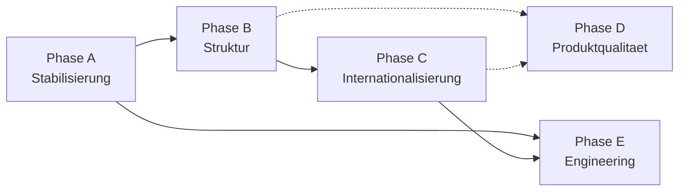

# JobHunter – Rework-Plan (Deutsch)

> **Status dieses Dokuments:** Vollständig, Kapitel 3 des Audit-Programms.
> Basiert ausschließlich auf den verifizierten Befunden aus
> `docs/analysis/REPOSITORY_AUDIT_DE.md` (Kapitel 1–2). Englische Fassung:
> `docs/analysis/REWORK_PLAN_EN.md` (inhaltsgleich).
>
> Stand: 2026-08-24.

## 3.1 Rework-Entscheidung

**Entscheidung: Gezielte Reparatur + modulare Restrukturierung.
Kein Neuaufbau.**

### Begründung

Die Entscheidung leitet sich unmittelbar aus dem Audit ab (nicht aus einer
allgemeinen Präferenz):

1. **Kein Stack-Element rechtfertigt einen Wechsel** (Audit 2.2) – FastAPI,
   SQLAlchemy/Postgres, React/Vite/TypeScript, TailwindCSS, i18next und
   Ollama passen durchweg zu Größe, Zielgruppe und Funktionsumfang des
   Produkts.
2. **Alle gefundenen Probleme sind Fertigstellungs-, Konfigurations- und
   Nutzungslücken, keine Architekturfehler** (Audit 2.1): drei kaputte
   Kommandozeilen-Pipelines mit Ein-Zeilen- bis Config-Datei-Fixes (Audit
   1.5), ein lokal isolierter Sicherheitsfund (Audit 1.6), tote Code-Pfade,
   die sich nachweislich folgenlos entfernen lassen (Audit 1.1/1.3/1.4),
   und ein i18n-System, das bereits vollständig installiert ist, aber zu
   89 % ungenutzt bleibt (Audit 1.2).
3. **Das Produkt selbst ist funktional bereits sehr weit** (README:
   v1.9.0, 30 Backend-Services, umfangreiche KI-Feature-Palette,
   WCAG-2.1-AA-Anspruch, DSGVO-Dokumentation bereits vorhanden) – ein
   Neuaufbau würde all das riskieren, ohne einen einzigen der im Audit
   gefundenen Fehler schneller zu lösen als eine gezielte Reparatur.
4. Ein Neuaufbau wäre nur gerechtfertigt, wenn die Architektur selbst dem
   Ziel (zweisprachiges, wartbares, self-hosted Job-Tool) im Weg stünde.
   Das ist laut Audit 2.2 nachweislich **nicht** der Fall.

**Restrukturierung (nicht reiner Refactor) ist trotzdem nötig**, weil
mehrere Strukturentscheidungen bereinigt werden müssen, bevor die
i18n-Migration in der Fläche sinnvoll ist: die gespaltene Endpunkt-Schicht
(`api/` vs. `routers/`), die fehlende zentrale Übersetzungs-/API-Client-
Struktur im Frontend, und die noch offene Produktentscheidung zum
`User`-Auth-Fragment. Das ist der Grund für fünf getrennte Phasen statt
eines einzigen „Bugfix-Sprints".

### Nicht gerechtfertigt, aber häufig naheliegend – explizit verworfene Optionen

- **Backend-Framework-Wechsel** (z. B. zu Django/Node): kein Befund im
  Audit deutet auf ein FastAPI-spezifisches Problem hin – verworfen.
- **Frontend-Framework-Wechsel** (z. B. zu Next.js/Svelte): React+Vite
  deckt alle Anforderungen technisch ab, das Problem ist Nutzungsgrad von
  i18next, nicht die Bibliothek – verworfen.
- **Kompletter i18n-Bibliothekswechsel**: i18next ist bereits korrekt
  konfiguriert (DE als Default+Fallback) – verworfen, stattdessen Ausbau
  der Nutzung (Phase C).
- **Managed-Hosting/Kubernetes**: würde dem Self-Hosting-Versprechen des
  Produkts widersprechen und die Betriebshürde für die Zielgruppe massiv
  erhöhen – verworfen.

## Phasenübersicht

| Phase | Ziel | Priorität | Geschätzte Größe |
|---|---|---|---|
| A – Stabilisierung | Build/Lint/Typen/Tests/Sicherheit/Doku absichern | Kritisch | M |
| B – Struktur | Zielstruktur, Modulgrenzen, Datenverträge, Config, Architekturregeln | Hoch | L |
| C – Internationalisierung | DE-Standard, EN-Übersetzung, Locale-Handling vollständig | Hoch (Kernauftrag) | XL |
| D – Produktqualität | UX, Accessibility, Fehler-/Ladezustände, Performance, Datenschutz | Mittel | L |
| E – Engineering | CI, Testpyramide, Release-Prozess, Dependency-Strategie, Quality Gates | Mittel | M |

**Reihenfolge ist bindend**: Phase A muss vor B–E abgeschlossen sein (ohne
lauffähige Tests/Lint/Build ist keine der folgenden Phasen verlässlich
verifizierbar, s. Audit 2.1). Phase C (Internationalisierung) sollte erst
nach Phase B beginnen, da die i18n-Migration von der bereinigten
Endpunkt-/Komponentenstruktur profitiert (weniger Migrationsaufwand pro
Datei). D und E können teilweise parallel zu C laufen, sobald A und B
stehen.

---

## Phase A – Stabilisierung

**Ziel:** Alle in Audit 1.5/1.6 verifiziert kaputten bzw. riskanten Pfade
beheben, sodass Tests, Linting, Build und die kritische Sicherheitslücke
zuverlässig funktionieren, bevor irgendeine weitere Änderung darauf
aufbaut.

### Aufgaben (in Reihenfolge)

1. `backend/tests/conftest.py`: Import `from backend.models import Base` →
   `from backend.core.database import Base` korrigieren. **Akzeptanz:**
   `pytest -q` läuft durch (mit `requirements-dev.txt` installiert), alle
   3 Testdateien werden gesammelt.
2. `frontend/eslint.config.js` anlegen (Flat Config, TypeScript+React-Regeln,
   passend zu ESLint 8.57.1). **Akzeptanz:** `npm run lint` läuft ohne
   Config-Fehler durch (inhaltliche Lint-Findings dürfen zunächst bestehen
   bleiben, werden als Folgeaufgabe abgearbeitet).
3. `frontend/tsconfig.json` anlegen (Basis: `tsc --init`, angepasst an
   Vite/React-JSX, `strict` zunächst moderat halten, um nicht sofort
   hunderte Fehler zu erzeugen – iterative Verschärfung als Folgeaufgabe).
   **Akzeptanz:** `npm run build` durchläuft `tsc` und `vite build`
   erfolgreich, `frontend/dist/` wird erzeugt.
4. `frontend/Dockerfile` auf Mehrstufen-Build umstellen (Build-Stage:
   `npm run build`; Serve-Stage: statischer Server, z. B. `nginx:alpine`
   oder `vite preview`). **Akzeptanz:** `docker compose up --build`
   liefert eine über `:3000` erreichbare, tatsächlich gebaute
   Production-Bundle-Antwort (keine Vite-HMR-Client-Skripte im
   Seitenquelltext mehr).
5. `backend/api/cv.py`: Upload-Dateinamen serverseitig generieren
   (`uuid4().hex + ext`), Original-Dateiname nur noch als Anzeige-Metadatum
   in der DB speichern, nicht mehr als Pfadbestandteil. **Akzeptanz:** Ein
   Upload mit Dateinamen wie `../../etc/test.pdf` landet nachweislich nur
   innerhalb von `UPLOAD_DIR`.
6. `backend/core/config.py`: `SECRET_KEY`/`ENCRYPTION_KEY` ohne gültigen
   `.env`-Wert lösen einen harten Startfehler aus statt stiller
   `"changeme"`-Defaults. **Akzeptanz:** Start ohne `.env` bricht mit
   klarer Fehlermeldung ab; Start mit vollständiger `.env` funktioniert
   unverändert.
7. Kurzer Review der bestehenden `docs/*.md`/`wiki/*.md` auf offensichtlich
   veraltete Aussagen im Licht der Audit-Befunde (z. B. falls `docs/setup.md`
   den kaputten Build-Befehl unkommentiert als funktionierend beschreibt) –
   punktuelle Korrekturen, keine Vollüberarbeitung (die folgt in Phase C/E).

### Betroffene Dateien/Module

`backend/tests/conftest.py`, `frontend/eslint.config.js` (neu),
`frontend/tsconfig.json` (neu), `frontend/Dockerfile`, `backend/api/cv.py`,
`backend/core/config.py`, punktuell `docs/setup.md`.

### Risiken & Rückfallstrategie

- **Risiko:** `tsconfig.json` mit striktem Modus deckt bestehende,
  bisher nie geprüfte Typfehler auf. **Rückfallstrategie:** `strict: false`
  zunächst, dediziertes Folge-Ticket für schrittweise Verschärfung.
- **Risiko:** Mehrstufiger Frontend-Build ändert Laufzeitverhalten (kein
  Hot Reload mehr im „Produktions"-Container). **Rückfallstrategie:**
  Dev-Compose-Override (`docker-compose.override.yml`) für lokale
  Entwicklung mit weiterhin laufendem Vite-Dev-Server einführen, sodass
  Entwicklererfahrung erhalten bleibt.
- **Risiko:** Upload-Pfad-Änderung bricht bestehende, bereits gespeicherte
  Dateireferenzen in der DB. **Rückfallstrategie:** Migration nur für neue
  Uploads greifen lassen, bestehende `CVData.filename`-Werte unangetastet
  lassen (Altdaten funktionieren weiter, nur neue Uploads sind
  abgesichert).

### Priorität / Aufwand

**Kritisch, Aufwand M** (Einzelaufgaben S–S/M, Summe wegen
Docker-Umstellung und Testabsicherung auf M geschätzt).

---

## Phase B – Struktur

**Ziel:** Die in Audit 1.1/1.3/2.1 gefundenen Struktur-Inkonsistenzen
bereinigen und Architekturregeln festschreiben, bevor die
i18n-Migration in der Fläche beginnt.

### Aufgaben (in Reihenfolge)

1. Tote Code-Pfade entfernen: `backend/models.py`, Top-Level-`/alembic/`
   (inkl. `/alembic.ini`). **Akzeptanz:** `grep` bestätigt keine Referenzen
   mehr, `pytest`/`alembic upgrade head` laufen unverändert durch.
2. Endpunkt-Schicht vereinheitlichen: Inhalte aus `backend/routers/`
   nach `backend/api/` verschieben (oder umgekehrt – Empfehlung: `api/`
   auflösen zugunsten von `routers/`, da der Name die tatsächliche Rolle
   klarer beschreibt), `main.py`-Imports entsprechend anpassen.
   **Akzeptanz:** Ein einziger Endpunkt-Ordner, alle 19 Module dort,
   `main.py` importiert nur noch daraus, App startet unverändert.
3. Produktentscheidung zu `User`/Auth einholen (siehe offene Frage in
   Audit 1.3/1.4/2.1) und danach **eine** der beiden Optionen umsetzen:
   - **Vervollständigen:** `User` in `models/__init__.py` registrieren,
     Migration für `users`-Tabelle ergänzen, `api/auth.py` in `main.py`
     einbinden, Owner-Feld an relevanten Modellen ergänzen (Grundlage für
     echte Mehrbenutzerfähigkeit).
   - **Entfernen:** `models/user.py`, `api/auth.py`,
     Auth-Teile aus `core/security.py` löschen, `AUTH_ENABLED`-Flag und
     zugehörige Doku entfernen.
   **Akzeptanz:** Je nach gewählter Option – entweder funktionierender
   `/auth/register`+`/auth/token`-Roundtrip in einem Test, oder
   nachweislich keine toten Auth-Referenzen mehr im Code.
4. Frontend: zentralen API-Client `frontend/src/lib/api.ts`
   (`axios.create({baseURL, ...})` + Response-Error-Interceptor) einführen.
   Bestehende 22 direkten `axios`-Aufrufe schrittweise darauf umstellen
   (kann mit Phase C kombiniert werden, da ohnehin jede Datei angefasst
   wird). **Akzeptanz:** Neuer Client existiert und wird in mindestens den
   in Phase A/B geänderten Dateien bereits verwendet; vollständige
   Migration aller 22 Stellen darf in Phase C/D abgeschlossen werden.
5. Namenskollision auflösen: `pages/CompanyDossier.tsx` →
   `pages/CompanyDossierPage.tsx` (oder analog), nach Klärung der
   tatsächlichen Rollenverteilung zu `components/CompanyDossier.tsx`.
6. Backend-Schema-Schicht ausbauen: pro Domäne mit aktuell fehlendem
   Pydantic-Schema (u. a. `reminders`, `cv`, `interview`, `company`) ein
   Schema-Modul ergänzen – schrittweise, endpunktweise, keine
   Big-Bang-Umstellung nötig.
7. Architekturregeln als kurzes Dokument festhalten (siehe `docs/architecture/`
   unten, Backlog 3.4): u. a. „Endpunkte immer in `routers/`", „jede
   Response nutzt ein Pydantic-Schema", „kein neuer direkter `axios`-Call
   außerhalb `lib/api.ts`".

### Betroffene Dateien/Module

`backend/models.py` (entfernt), `/alembic/` (entfernt),
`backend/routers/*` ↔ `backend/api/*` (konsolidiert), `backend/main.py`,
`backend/models/user.py`, `backend/api/auth.py`, `backend/core/security.py`
(je nach Entscheidung), `frontend/src/lib/api.ts` (neu),
`frontend/src/pages/CompanyDossier.tsx`, `backend/schemas/*` (neue Module),
`docs/architecture/` (neu).

### Risiken & Rückfallstrategie

- **Risiko:** Verschieben von `routers/`↔`api/` bricht stillschweigend
  Importe in Tests oder Skripten außerhalb des Hauptpfads.
  **Rückfallstrategie:** Nach dem Verschieben vollständige Textsuche nach
  alten Importpfaden (`from backend.api import`/`from backend.routers import`)
  als Abschlussschritt, nicht nur `main.py` prüfen.
- **Risiko:** Auth-Entscheidung (vervollständigen vs. entfernen) ist eine
  echte Produktentscheidung, keine rein technische – falsche Annahme würde
  Aufwand verschwenden. **Rückfallstrategie:** Diesen Punkt explizit als
  Freigabe-Punkt behandeln, nicht ohne Bestätigung umsetzen (s.
  Abschlussbericht, „Offene Risiken/Entscheidungen").

### Priorität / Aufwand

**Hoch, Aufwand L** (mehrere mittelgroße, aber risikoarme Einzelschritte;
Aufwandstreiber ist Schritt 4, der viele Dateien berührt).

---

## Phase C – Internationalisierung

**Ziel:** Deutsch bleibt Standard-/Fallback-Sprache, Englisch wird
vollständig gleichwertig ausgebaut – auf Basis der bereits vorhandenen,
funktionierenden i18next/react-i18next-Infrastruktur (Audit 1.2, 2.2:
kein Bibliothekswechsel nötig).

### Aufgaben (in Reihenfolge)

1. `docs/i18n/KONZEPT.md` schreiben (siehe Backlog 4.1/Deliverable-Liste):
   Namensraum-Schema (ein JSON pro Seite/Feature statt einer Monolith-Datei),
   Schlüsselkonvention (semantisch, z. B. `jobs.search.placeholder`, nicht
   Satz-als-Schlüssel), Persistenzstrategie (weiterhin `localStorage`,
   künftig optional Nutzerprofil-Feld sobald/falls Mehrbenutzerfähigkeit
   aus Phase B kommt), Datums-/Zahlenformat via `Intl` pro Locale.
2. `frontend/src/i18n.ts` von Inline-Objekt auf Namespace-Struktur
   umstellen: `frontend/src/locales/de/{nav,dashboard,jobs,kanban,
   reminders,settings,common,...}.json` und äquivalente `en/`-Struktur.
   Migration der bereits vorhandenen 5 übersetzten Bereiche als erster,
   risikoarmer Schritt (reine Umstrukturierung, keine neuen Inhalte).
3. Batch-weise Migration der ~40 noch nicht angebundenen Dateien,
   gruppiert nach Feature (nicht alle 40 auf einmal):
   - Batch 1: Kanban + CoverLetter (Kernworkflow)
   - Batch 2: Reminders, SearchProfiles, History
   - Batch 3: InterviewSimulator, CompanyDossier (Seite + Komponente)
   - Batch 4: alle Panels/Modals (`AtsScorePanel`, `BadgesPanel`,
     `CoachChatDrawer`, `EmailParsingSetup`, `ExportImportPanel`,
     `MarketAnalyzerPanel`, `SalaryNegotiationModal`, `QualityScoreCard`,
     u. a.)
   - Batch 5: verbleibende kleinere Komponenten (`DeadlineBadge`,
     `GhostJobBadge`, `ConfirmDialog`, `ShortcutOverlay`, `UndoToast`, …)
   Jeder Batch: hartcodierte Strings extrahieren → Schlüssel in
   `de/*.json` **und** `en/*.json` gleichzeitig ergänzen (nie nur eine
   Sprache), Komponente auf `useTranslation` umstellen.
4. Backend-Internationalisierung: Fehlertexte/Validierungsmeldungen in
   `api/`/`routers/` (aktuell durchgängig deutsche `HTTPException`-Details,
   z. B. `api/auth.py`: `"Falsche Zugangsdaten"`) auf Fehlercodes statt
   Klartext umstellen (`{"error_code": "invalid_credentials"}`), Übersetzung
   erfolgt im Frontend über dieselbe i18n-Struktur. E-Mail-Templates
   (`services/email_templates.py`, `services/default_templates.py`)
   erhalten je eine DE- und EN-Variante, Auswahl über Nutzereinstellung.
5. Locale-Erkennung/-Umschaltung im Frontend: Sprachschalter in
   `Settings.tsx` (bereits vorhandenes `settings.language`-Schlüsselfeld
   nutzen), Auswahl in `localStorage` persistieren (Muster aus `i18n.ts`
   bereits vorhanden), **keine** automatische Browser-Locale-Übernahme
   (Audit 1.2 bestätigt: aktuell schon korrekt so umgesetzt – nur
   sicherstellen, dass die Umschaltung im UI sichtbar/erreichbar ist).
6. CI-Prüfung auf fehlende/verwaiste Schlüssel (siehe auch Phase E):
   Node-Skript, das `de/*.json`- und `en/*.json`-Schlüsselmengen
   vergleicht und Diff als Fehler meldet; separater Check auf im Code
   referenzierte, aber nicht vorhandene Schlüssel.
7. `docs/`, `wiki/`, `README.md`/`README.de.md` auf das im Auftrag
   geforderte Schema vereinheitlichen (getrennte Seiten statt Ein-Datei-Mix
   – betrifft v. a. `docs/architecture.md`, `docs/CHANGELOG.md`), siehe
   auch Phase 5 (Wiki) im übergeordneten Backlog.

### Betroffene Dateien/Module

`frontend/src/i18n.ts`, `frontend/src/locales/{de,en}/*.json` (neu, ersetzt
Inline-Objekt), alle 45 Frontend-Dateien schrittweise (s. Batches oben),
`backend/api/*`/`backend/routers/*` (Fehlertexte), `services/email_templates.py`,
`services/default_templates.py`, `docs/i18n/KONZEPT.md` (neu).

### Akzeptanzkriterien (gesamte Phase)

- 45/45 Frontend-Dateien mit sichtbarem UI-Text nutzen `useTranslation`
  bzw. beziehen Text ausschließlich aus den Locale-Dateien.
- Kein sichtbarer Übersetzungsschlüssel als Fallback im UI (manueller
  Durchklick DE **und** EN vor Abschluss der Phase).
- CI-Check auf Schlüssel-Parität (DE↔EN) grün.
- Backend-Fehlermeldungen sind über Fehlercodes lokalisierbar, mindestens
  die 5 häufigsten Endpunkte (Login, Upload, Settings-Save, Job-Suche,
  Erinnerung anlegen) exemplarisch umgestellt und verifiziert.

### Risiken & Rückfallstrategie

- **Risiko:** Migration von ~40 Dateien in Batches kann Regressionen in
  UI-Texten erzeugen (falsch zugeordnete Schlüssel). **Rückfallstrategie:**
  Jeder Batch als eigener PR/Commit mit manuellem DE+EN-Durchklick vor
  Merge; kleine Batches statt Big Bang minimieren Blast-Radius.
- **Risiko:** Fehlercode-Umstellung im Backend ist ein Breaking Change für
  eventuelle bestehende API-Konsumenten. **Rückfallstrategie:** Fehlercode
  **zusätzlich** zum bisherigen deutschen Klartext ausliefern
  (`{"detail": "...", "error_code": "..."}`), Klartext erst entfernen,
  wenn das Frontend vollständig auf `error_code` umgestellt ist.

### Priorität / Aufwand

**Hoch (Kernauftrag), Aufwand XL** (Backend-Fehlertexte S, Konzept S,
Frontend-Migration dominiert mit L–XL wegen Dateizahl und nötiger
manueller Qualitätssicherung pro Batch).

---

## Phase D – Produktqualität

**Ziel:** UX, Accessibility, Fehler-/Ladezustände, Performance und
Datenschutz auf den bereits hohen Anspruch des Produkts (WCAG 2.1 AA,
DSGVO-Doku vorhanden) konsolidieren und dort schließen, wo das Audit
Lücken zeigt.

### Aufgaben (in Reihenfolge)

1. Fehlerzustände systematisch prüfen: Für die 22 (künftig zentralisierten,
   s. Phase B) API-Aufrufe existiert aktuell keine einheitliche
   Fehleranzeige – im Zuge der `lib/api.ts`-Einführung einheitliche
   Error-Toast-/Inline-Fehlerkomponente ergänzen (kann auf vorhandenem
   `UndoToast`-Muster aufbauen).
2. Ladezustände: Stichprobenartig prüfen, ob React-Query-`isLoading`-States
   überall mit sichtbarem Feedback (Skeleton/Spinner) verbunden sind – im
   Rahmen der ohnehin laufenden i18n-Batches (Phase C) mit erledigen, da
   dieselben Dateien angefasst werden.
3. Accessibility: Bestehende Features (Dyslexie-Theme, Farbenblind-Filter,
   ADHS-Modus, Tastatur-Shortcuts, ARIA/Skip-Links) sind laut README
   vorhanden – Audit hat sie nicht im Detail gegen WCAG 2.1 AA
   nachgeprüft (außerhalb des Scopes von Kapitel 1). **Empfehlung:**
   dedizierter Accessibility-Audit-Pass (axe-core o. ä. gegen die
   laufende App) als eigenes, kleines Folgeticket – nicht Teil dieses
   Rework-Plans, da kein konkreter Mangel im Code-Audit gefunden wurde.
4. Performance: Haupttreiber laut Audit 1.5 ist der Dev-Server-statt-Build-
   Zustand (bereits in Phase A behoben). Zusätzlich: `vite build`-Output
   nach Phase A auf Bundle-Größe prüfen (`vite build --report` o. ä.),
   ggf. Code-Splitting für seltener genutzte Seiten (`InterviewSimulator`,
   `CompanyDossier`) ergänzen.
5. Datenschutz: `docs/dsgvo.md`/`docs/PRIVACY.md` sind inhaltlich bereits
   solide (Audit 1.6) – im Zuge von Phase C auf vollständige,
   gleichwertige EN-Fassung prüfen (beide Dateien behaupten bereits
   Zweisprachigkeit, Detailabgleich nötig) und ggf. um die in Phase A/B
   neu eingeführten Verhaltensänderungen ergänzen (z. B. harte
   Secret-Validierung).

### Betroffene Dateien/Module

`frontend/src/lib/api.ts` (Error-Handling-Erweiterung), diverse
`pages/*`/`components/*` (Loading-States, im Rahmen von Phase-C-Batches),
`docs/dsgvo.md`, `docs/PRIVACY.md`.

### Akzeptanzkriterien

- Jeder zentrale API-Aufruf zeigt bei Fehler eine für den Nutzer
  verständliche, übersetzte Meldung statt eines stillen Fehlschlags.
- `docs/dsgvo.md`/`docs/PRIVACY.md` DE/EN inhaltlich abgeglichen.
- Kein neuer Performance-Regressions-Befund nach Phase A (Build-Umstellung)
  – Bundle-Größe dokumentiert als Baseline für künftige Vergleiche.

### Risiken & Rückfallstrategie

- **Risiko:** Accessibility-Anspruch (WCAG 2.1 AA) ist eine Behauptung im
  README, aber nicht Teil dieses Code-Audits – ein späterer dedizierter
  Audit könnte Lücken finden, die hier nicht eingeplant sind.
  **Rückfallstrategie:** Als expliziten offenen Punkt im Abschlussbericht
  markieren, nicht stillschweigend als „erledigt" behandeln.

### Priorität / Aufwand

**Mittel, Aufwand L** (größtenteils additiv zu Phase C, daher geringer
Grenzaufwand, aber viele Einzeldateien betroffen).

---

## Phase E – Engineering

**Ziel:** CI, Testpyramide, Release-Prozess und Dependency-Strategie
einführen – **erst nachdem** Phase A die drei kaputten Pipelines behoben
hat (sonst wäre eine neu eingeführte CI sofort und dauerhaft rot, Audit 1.5).

### Aufgaben (in Reihenfolge)

1. `.github/workflows/ci.yml`: Drei Jobs – Backend (`pytest`, nach Phase A
   lauffähig), Frontend (`npm run lint` + `npm run build`, nach Phase A
   lauffähig), i18n-Schlüssel-Check (aus Phase C, Aufgabe 6). Läuft auf
   jedem PR gegen `main`.
2. Testpyramide ausbauen: Aktuell nur 1 inhaltlicher Backend-Testfall
   (`test_followup_scheduler.py`) und 0 Frontend-Tests (Audit 1.5).
   Priorisierung nach Risiko, nicht nach Vollständigkeit: zuerst Tests für
   den in Phase A gefixten Upload-Pfad (Regressionsschutz für den
   Sicherheitsfund), danach für die zentralen Endpunkte aus Phase D
   (Login/Upload/Settings/Jobsuche/Reminder). Frontend: `vitest` (passt
   nativ zu Vite) für den neuen `lib/api.ts`-Client und mindestens die in
   Phase C migrierten Kernseiten (Kanban, CoverLetter) ergänzen.
3. `dependabot.yml` für `pip` (`backend/requirements.txt`) und `npm`
   (`frontend/package.json`) einrichten, wöchentlicher Rhythmus,
   Auto-Merge nur für Patch-Versionen falls gewünscht (Produktentscheidung,
   nicht hier vorausgesetzt).
4. `.pre-commit-config.yaml` einführen (mind. Lint-Check vor Commit, sobald
   Phase A die ESLint-Config etabliert hat).
5. Release-Prozess dokumentieren: `CHANGELOG.md` wird laut Git-Historie
   bereits gepflegt – Prozess (wann Version bumpen, wie taggen) in
   `CONTRIBUTING.md` explizit machen, da aktuell nicht dokumentiert
   (Annahme: informeller Prozess, nicht im Audit verifiziert).

### Betroffene Dateien/Module

`.github/workflows/ci.yml` (neu), `backend/tests/*` (Erweiterung),
`frontend/src/**/*.test.tsx` (neu), `.github/dependabot.yml` (neu),
`.pre-commit-config.yaml` (neu), `CONTRIBUTING.md`.

### Akzeptanzkriterien

- CI läuft grün auf dem `main`-Branch nach Merge von Phase A.
- Mindestens 5 neue, inhaltlich sinnvolle Testfälle über Backend+Frontend
  hinweg (nicht nur Config-Tests).
- Dependabot erzeugt sichtbar PRs für veraltete Abhängigkeiten.

### Risiken & Rückfallstrategie

- **Risiko:** CI zu früh (vor Phase A) eingeführt wäre dauerhaft rot und
  würde ignoriert werden. **Rückfallstrategie:** Reihenfolge ist hier
  bewusst bindend – Phase E startet nicht vor Abschluss von Phase A.

### Priorität / Aufwand

**Mittel, Aufwand M.**

---

## Zusammenfassende Abhängigkeitskette

---

*Rework-Plan abgeschlossen. Nächster Schritt laut übergeordnetem Backlog:
3.4 Architekturdiagramme/ADRs in `docs/architecture/`, danach Checkpoint
zur Freigabe vor Beginn der Umsetzung (Phase A–E).*
