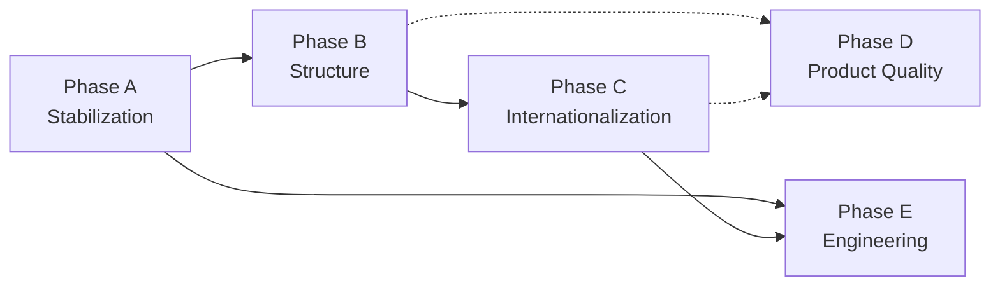

# JobHunter – Rework Plan (English)

> **Status of this document:** Complete, Chapter 3 of the audit program.
> Based exclusively on the verified findings from
> `docs/analysis/REPOSITORY_AUDIT_EN.md` (Chapters 1–2). German version:
> `docs/analysis/REWORK_PLAN_DE.md` (equivalent content).
>
> As of: 2026-08-24.

## 3.1 Rework Decision

**Decision: Targeted repair + modular restructuring. No rebuild.**

### Rationale

The decision follows directly from the audit (not from a general
preference):

1. **No stack element justifies a switch** (Audit 2.2) – FastAPI,
   SQLAlchemy/Postgres, React/Vite/TypeScript, TailwindCSS, i18next, and
   Ollama consistently fit the product's size, target audience, and
   feature scope.
2. **Every problem found is a completion, configuration, or usage gap, not
   an architecture flaw** (Audit 2.1): three broken command-line pipelines
   with one-line-to-config-file fixes (Audit 1.5), one locally isolated
   security finding (Audit 1.6), dead code paths that can demonstrably be
   removed without consequence (Audit 1.1/1.3/1.4), and an i18n system
   that is already fully installed but 89% unused (Audit 1.2).
3. **The product itself is already functionally very far along** (README:
   v1.9.0, 30 backend services, an extensive AI feature set, a WCAG 2.1 AA
   claim, GDPR documentation already present) – a rebuild would put all of
   that at risk without resolving a single audit finding faster than a
   targeted repair would.
4. A rebuild would only be justified if the architecture itself stood in
   the way of the goal (a bilingual, maintainable, self-hosted job tool).
   Per Audit 2.2, that is demonstrably **not** the case.

**Restructuring (not a pure refactor) is nonetheless needed**, because
several structural decisions must be cleaned up before the i18n migration
can proceed sensibly at scale: the split endpoint layer (`api/` vs.
`routers/`), the missing central translation/API-client structure in the
frontend, and the still-open product decision on the `User` auth fragment.
That is the reason for five separate phases instead of a single "bugfix
sprint."

### Not Justified but Often Tempting – Explicitly Rejected Options

- **Backend framework switch** (e.g. to Django/Node): no audit finding
  points to a FastAPI-specific problem – rejected.
- **Frontend framework switch** (e.g. to Next.js/Svelte): React+Vite
  technically covers all requirements; the problem is i18next's usage
  level, not the library – rejected.
- **Complete i18n library switch**: i18next is already correctly
  configured (German as default+fallback) – rejected, usage expansion
  instead (Phase C).
- **Managed hosting/Kubernetes**: would contradict the product's
  self-hosting promise and massively raise the operational barrier for
  the target audience – rejected.

## Phase Overview

| Phase | Goal | Priority | Estimated size |
|---|---|---|---|
| A – Stabilization | Secure build/lint/types/tests/security/docs | Critical | M |
| B – Structure | Target structure, module boundaries, data contracts, config, architecture rules | High | L |
| C – Internationalization | Complete DE default, EN translation, locale handling | High (core of the brief) | XL |
| D – Product Quality | UX, accessibility, error/loading states, performance, privacy | Medium | L |
| E – Engineering | CI, test pyramid, release process, dependency strategy, quality gates | Medium | M |

**The order is binding**: Phase A must be complete before B–E (without
runnable tests/lint/build, none of the following phases can be reliably
verified, see Audit 2.1). Phase C (internationalization) should only start
after Phase B, since the i18n migration benefits from the cleaned-up
endpoint/component structure (less migration effort per file). D and E can
partly run in parallel with C once A and B are in place.

---

## Phase A – Stabilization

**Goal:** Fix all paths verified as broken or risky in Audit 1.5/1.6, so
tests, linting, build, and the critical security hole reliably work before
any further change builds on top of them.

### Tasks (in order)

1. `backend/tests/conftest.py`: fix the import
   `from backend.models import Base` → `from backend.core.database import Base`.
   **Acceptance:** `pytest -q` completes (with `requirements-dev.txt`
   installed), all 3 test files are collected.
2. Create `frontend/eslint.config.js` (flat config, TypeScript+React rules,
   matching ESLint 8.57.1). **Acceptance:** `npm run lint` runs without a
   config error (content-level lint findings may remain for now, handled
   as a follow-up).
3. Create `frontend/tsconfig.json` (base: `tsc --init`, adapted for
   Vite/React JSX, keep `strict` moderate initially to avoid instantly
   generating hundreds of errors – iterative tightening as a follow-up).
   **Acceptance:** `npm run build` runs `tsc` and `vite build`
   successfully, `frontend/dist/` is produced.
4. Switch `frontend/Dockerfile` to a multi-stage build (build stage:
   `npm run build`; serve stage: a static server, e.g. `nginx:alpine` or
   `vite preview`). **Acceptance:** `docker compose up --build` serves an
   actually built production bundle on `:3000` (no more Vite HMR client
   scripts in the page source).
5. `backend/api/cv.py`: generate upload filenames server-side
   (`uuid4().hex + ext`), store the original filename only as display
   metadata in the DB, no longer as part of the path. **Acceptance:** an
   upload with a filename like `../../etc/test.pdf` demonstrably ends up
   only inside `UPLOAD_DIR`.
6. `backend/core/config.py`: make `SECRET_KEY`/`ENCRYPTION_KEY` without a
   valid `.env` value trigger a hard startup failure instead of a silent
   `"changeme"` default. **Acceptance:** startup without `.env` aborts with
   a clear error message; startup with a complete `.env` works unchanged.
7. Brief review of existing `docs/*.md`/`wiki/*.md` for obviously outdated
   statements in light of the audit findings (e.g. if `docs/setup.md`
   describes the broken build command as working without comment) –
   point fixes only, not a full rewrite (that follows in Phase C/E).

### Affected Files/Modules

`backend/tests/conftest.py`, `frontend/eslint.config.js` (new),
`frontend/tsconfig.json` (new), `frontend/Dockerfile`, `backend/api/cv.py`,
`backend/core/config.py`, spot fixes in `docs/setup.md`.

### Risks & Fallback Strategy

- **Risk:** a strict-mode `tsconfig.json` surfaces pre-existing, never
  type-checked errors. **Fallback:** start with `strict: false`, a
  dedicated follow-up ticket for gradual tightening.
- **Risk:** the multi-stage frontend build changes runtime behavior (no
  more hot reload in the "production" container). **Fallback:** introduce
  a dev compose override (`docker-compose.override.yml`) for local
  development that keeps running the Vite dev server, preserving developer
  experience.
- **Risk:** the upload-path change breaks existing, already-stored file
  references in the DB. **Fallback:** apply the change only to new
  uploads, leave existing `CVData.filename` values untouched (legacy data
  keeps working, only new uploads are hardened).

### Priority / Effort

**Critical, effort M** (individual tasks S–S/M, sum estimated at M due to
the Docker changeover and test hardening).

---

## Phase B – Structure

**Goal:** Clean up the structural inconsistencies found in Audit
1.1/1.3/2.1 and lock in architecture rules before the i18n migration
begins at scale.

### Tasks (in order)

1. Remove dead code paths: `backend/models.py`, top-level `/alembic/`
   (incl. `/alembic.ini`). **Acceptance:** `grep` confirms no remaining
   references, `pytest`/`alembic upgrade head` still pass unchanged.
2. Unify the endpoint layer: move the contents of `backend/routers/` into
   `backend/api/` (or the reverse – recommendation: dissolve `api/` in
   favor of `routers/`, since that name more clearly describes the actual
   role), adjust `main.py` imports accordingly. **Acceptance:** a single
   endpoint directory, all 19 modules in it, `main.py` imports only from
   there, the app starts unchanged.
3. Obtain a product decision on `User`/auth (see the open question in
   Audit 1.3/1.4/2.1) and then implement **one** of the two options:
   - **Complete it:** register `User` in `models/__init__.py`, add a
     migration for the `users` table, include `api/auth.py` in `main.py`,
     add an owner field to the relevant models (foundation for real
     multi-user capability).
   - **Remove it:** delete `models/user.py`, `api/auth.py`, the auth parts
     of `core/security.py`, remove the `AUTH_ENABLED` flag and related
     documentation.
   **Acceptance:** depending on the option chosen – either a working
   `/auth/register`+`/auth/token` round trip in a test, or demonstrably no
   dead auth references left in the code.
4. Frontend: introduce a central API client `frontend/src/lib/api.ts`
   (`axios.create({baseURL, ...})` + a response error interceptor).
   Migrate the existing 22 direct `axios` calls onto it incrementally (can
   be combined with Phase C, since every file gets touched anyway).
   **Acceptance:** the new client exists and is already used in at least
   the files changed during Phase A/B; the full migration of all 22 spots
   may be completed during Phase C/D.
5. Resolve the naming collision: `pages/CompanyDossier.tsx` →
   `pages/CompanyDossierPage.tsx` (or similar), after clarifying the
   actual division of roles with `components/CompanyDossier.tsx`.
6. Expand the backend schema layer: add a schema module per domain
   currently missing a Pydantic schema (incl. `reminders`, `cv`,
   `interview`, `company`) – incrementally, per endpoint, no big-bang
   changeover needed.
7. Record architecture rules as a short document (see `docs/architecture/`
   below, backlog 3.4): e.g. "endpoints always live in `routers/`",
   "every response uses a Pydantic schema", "no new direct `axios` call
   outside `lib/api.ts`".

### Affected Files/Modules

`backend/models.py` (removed), `/alembic/` (removed),
`backend/routers/*` ↔ `backend/api/*` (consolidated), `backend/main.py`,
`backend/models/user.py`, `backend/api/auth.py`, `backend/core/security.py`
(depending on the decision), `frontend/src/lib/api.ts` (new),
`frontend/src/pages/CompanyDossier.tsx`, `backend/schemas/*` (new
modules), `docs/architecture/` (new).

### Risks & Fallback Strategy

- **Risk:** moving `routers/`↔`api/` silently breaks imports in tests or
  scripts outside the main path. **Fallback:** after moving, do a full
  text search for old import paths
  (`from backend.api import`/`from backend.routers import`) as a final
  step, not just checking `main.py`.
- **Risk:** the auth decision (complete vs. remove) is a genuine product
  decision, not a purely technical one – a wrong assumption would waste
  effort. **Fallback:** treat this point explicitly as a sign-off point,
  do not implement without confirmation (see final report, "Open
  Risks/Decisions").

### Priority / Effort

**High, effort L** (several medium-sized but low-risk individual steps;
the effort driver is step 4, which touches many files).

---

## Phase C – Internationalization

**Goal:** German remains the default/fallback language; English is built
out to full parity – on top of the already-present, working
i18next/react-i18next infrastructure (Audit 1.2, 2.2: no library switch
needed).

### Tasks (in order)

1. Write `docs/i18n/KONZEPT.md` (see backlog 4.1/deliverables list):
   namespace scheme (one JSON per page/feature instead of a monolithic
   file), key convention (semantic, e.g. `jobs.search.placeholder`, not
   sentence-as-key), persistence strategy (`localStorage` for now,
   optionally a user-profile field later if/when multi-user capability
   comes out of Phase B), date/number formatting via `Intl` per locale.
2. Convert `frontend/src/i18n.ts` from an inline object to a namespace
   structure: `frontend/src/locales/de/{nav,dashboard,jobs,kanban,
   reminders,settings,common,...}.json` and an equivalent `en/` structure.
   Migrating the 5 already-translated areas is the first, low-risk step
   (pure restructuring, no new content).
3. Batch-wise migration of the ~40 not-yet-wired files, grouped by feature
   (not all 40 at once):
   - Batch 1: Kanban + CoverLetter (core workflow)
   - Batch 2: Reminders, SearchProfiles, History
   - Batch 3: InterviewSimulator, CompanyDossier (page + component)
   - Batch 4: all panels/modals (`AtsScorePanel`, `BadgesPanel`,
     `CoachChatDrawer`, `EmailParsingSetup`, `ExportImportPanel`,
     `MarketAnalyzerPanel`, `SalaryNegotiationModal`, `QualityScoreCard`,
     etc.)
   - Batch 5: remaining smaller components (`DeadlineBadge`,
     `GhostJobBadge`, `ConfirmDialog`, `ShortcutOverlay`, `UndoToast`, …)
   Each batch: extract hardcoded strings → add keys to `de/*.json` **and**
   `en/*.json` simultaneously (never just one language), switch the
   component to `useTranslation`.
4. Backend internationalization: convert error/validation messages in
   `api/`/`routers/` (currently consistently German `HTTPException`
   details, e.g. `api/auth.py`: `"Falsche Zugangsdaten"`) to error codes
   instead of plain text (`{"error_code": "invalid_credentials"}`);
   translation happens in the frontend via the same i18n structure. E-mail
   templates (`services/email_templates.py`, `services/default_templates.py`)
   get a DE and an EN variant each, selected via a user setting.
5. Locale detection/switching in the frontend: a language switch in
   `Settings.tsx` (reuse the already-present `settings.language` key
   field), persist the choice in `localStorage` (pattern already present
   in `i18n.ts`), **no** automatic browser-locale takeover (Audit 1.2
   confirms this is already correctly implemented – just ensure the
   switch is visible/reachable in the UI).
6. CI check for missing/orphaned keys (see also Phase E): a Node script
   that compares the key sets of `de/*.json` and `en/*.json` and reports a
   diff as an error; a separate check for keys referenced in code but not
   present.
7. Unify `docs/`, `wiki/`, `README.md`/`README.de.md` on the scheme
   requested in the brief (separate pages instead of a single-file mix –
   affects mainly `docs/architecture.md`, `docs/CHANGELOG.md`), see also
   Phase 5 (Wiki) in the overarching backlog.

### Affected Files/Modules

`frontend/src/i18n.ts`, `frontend/src/locales/{de,en}/*.json` (new,
replaces the inline object), all 45 frontend files incrementally (see
batches above), `backend/api/*`/`backend/routers/*` (error messages),
`services/email_templates.py`, `services/default_templates.py`,
`docs/i18n/KONZEPT.md` (new).

### Acceptance Criteria (whole phase)

- 45/45 frontend files with visible UI text use `useTranslation` or draw
  text exclusively from the locale files.
- No visible translation key as a UI fallback (manual DE **and** EN
  click-through before the phase is closed).
- CI key-parity check (DE↔EN) is green.
- Backend error messages are localizable via error codes; at minimum the 5
  most-used endpoints (login, upload, settings save, job search, create
  reminder) converted and verified as examples.

### Risks & Fallback Strategy

- **Risk:** migrating ~40 files in batches can introduce regressions in UI
  text (misassigned keys). **Fallback:** each batch as its own PR/commit
  with a manual DE+EN click-through before merge; small batches instead of
  a big bang minimize blast radius.
- **Risk:** the backend error-code changeover is a breaking change for any
  existing API consumers. **Fallback:** ship the error code **in
  addition** to the existing German plain text
  (`{"detail": "...", "error_code": "..."}`), remove the plain text only
  once the frontend is fully switched to `error_code`.

### Priority / Effort

**High (core of the brief), effort XL** (backend error texts S, concept S,
frontend migration dominates at L–XL due to file count and the manual QA
required per batch).

---

## Phase D – Product Quality

**Goal:** Consolidate UX, accessibility, error/loading states, performance,
and privacy up to the product's already-high standard (WCAG 2.1 AA, GDPR
docs present), and close the gaps the audit found.

### Tasks (in order)

1. Systematically review error states: the 22 (soon centralized, see
   Phase B) API calls currently have no unified error display – add a
   unified error toast/inline error component as part of introducing
   `lib/api.ts` (can build on the existing `UndoToast` pattern).
2. Loading states: spot-check whether React Query `isLoading` states are
   everywhere paired with visible feedback (skeleton/spinner) – handle
   this as part of the i18n batches already underway (Phase C), since the
   same files get touched.
3. Accessibility: existing features (dyslexia theme, color-blind filters,
   ADHD mode, keyboard shortcuts, ARIA/skip links) are present per the
   README – the audit did not verify them in detail against WCAG 2.1 AA
   (out of scope for Chapter 1). **Recommendation:** a dedicated
   accessibility audit pass (axe-core or similar against the running app)
   as its own small follow-up ticket – not part of this rework plan, since
   no concrete defect was found in the code audit.
4. Performance: per Audit 1.5, the main driver is the dev-server-instead-
   of-build state (already fixed in Phase A). Additionally: check the
   `vite build` output's bundle size after Phase A (`vite build --report`
   or similar), add code splitting for less-used pages
   (`InterviewSimulator`, `CompanyDossier`) if warranted.
5. Privacy: `docs/dsgvo.md`/`docs/PRIVACY.md` are already substantively
   solid (Audit 1.6) – check for a complete, equivalent EN version as part
   of Phase C (both files already claim bilingualism, a detailed
   comparison is needed) and extend them, if needed, with the behavior
   changes newly introduced in Phase A/B (e.g. hard secret validation).

### Affected Files/Modules

`frontend/src/lib/api.ts` (error-handling extension), various
`pages/*`/`components/*` (loading states, as part of Phase C batches),
`docs/dsgvo.md`, `docs/PRIVACY.md`.

### Acceptance Criteria

- Every central API call shows a user-understandable, translated message
  on failure instead of a silent failure.
- `docs/dsgvo.md`/`docs/PRIVACY.md` DE/EN content-matched.
- No new performance regression found after Phase A (build changeover) –
  bundle size documented as a baseline for future comparisons.

### Risks & Fallback Strategy

- **Risk:** the accessibility claim (WCAG 2.1 AA) is an assertion in the
  README, but not part of this code audit – a later dedicated audit could
  find gaps not planned for here. **Fallback:** flag this explicitly as an
  open item in the final report, do not silently treat it as "done."

### Priority / Effort

**Medium, effort L** (mostly additive to Phase C, hence low marginal
effort, but many individual files affected).

---

## Phase E – Engineering

**Goal:** Introduce CI, a test pyramid, a release process, and a
dependency strategy – **only after** Phase A has fixed the three broken
pipelines (otherwise a newly introduced CI would be immediately and
permanently red, Audit 1.5).

### Tasks (in order)

1. `.github/workflows/ci.yml`: three jobs – backend (`pytest`, runnable
   after Phase A), frontend (`npm run lint` + `npm run build`, runnable
   after Phase A), i18n key check (from Phase C, task 6). Runs on every PR
   against `main`.
2. Expand the test pyramid: currently only 1 substantive backend test case
   (`test_followup_scheduler.py`) and 0 frontend tests (Audit 1.5).
   Prioritize by risk, not completeness: first, tests for the upload path
   fixed in Phase A (regression protection for the security finding), then
   for the central endpoints from Phase D (login/upload/settings/job
   search/reminder). Frontend: add `vitest` (fits Vite natively) for the
   new `lib/api.ts` client and at least the core pages migrated in Phase C
   (Kanban, CoverLetter).
3. Set up `dependabot.yml` for `pip` (`backend/requirements.txt`) and `npm`
   (`frontend/package.json`), weekly cadence, auto-merge for patch versions
   only if desired (a product decision, not assumed here).
4. Introduce `.pre-commit-config.yaml` (at least a lint check before
   commit, once Phase A has established the ESLint config).
5. Document the release process: `CHANGELOG.md` is already maintained per
   the git history – make the process (when to bump the version, how to
   tag) explicit in `CONTRIBUTING.md`, since it is currently undocumented
   (assumption: an informal process, not verified in the audit).

### Affected Files/Modules

`.github/workflows/ci.yml` (new), `backend/tests/*` (expansion),
`frontend/src/**/*.test.tsx` (new), `.github/dependabot.yml` (new),
`.pre-commit-config.yaml` (new), `CONTRIBUTING.md`.

### Acceptance Criteria

- CI is green on the `main` branch after Phase A is merged.
- At least 5 new, substantively meaningful test cases spanning
  backend+frontend (not just config tests).
- Dependabot visibly produces PRs for outdated dependencies.

### Risks & Fallback Strategy

- **Risk:** introducing CI too early (before Phase A) would be permanently
  red and get ignored. **Fallback:** the order here is deliberately
  binding – Phase E does not start before Phase A is complete.

### Priority / Effort

**Medium, effort M.**

---

## Summary Dependency Chain

---

*Rework plan complete. Next step per the overarching backlog: 3.4
architecture diagrams/ADRs in `docs/architecture/`, then a checkpoint for
sign-off before implementation (Phases A–E) begins.*
