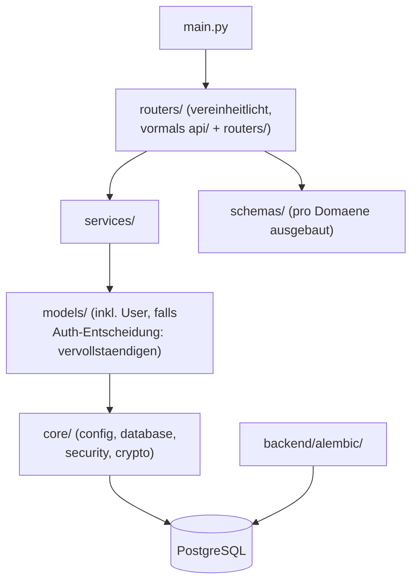
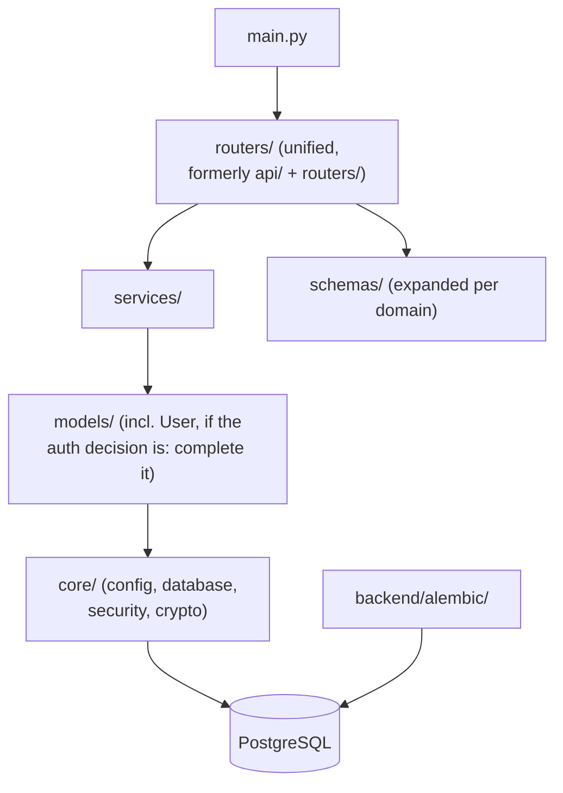

# Architekturdiagramme / Architecture Diagrams

🇩🇪 [Deutsche Version](#deutsch) | 🇬🇧 [English Version](#english)

---

## Deutsch

> Quelle: `docs/analysis/REPOSITORY_AUDIT_DE.md`, Abschnitt 1.7 (Stand
> 2026-08-24). Beide Diagramme bilden ausschließlich tatsächlich im Code
> vorgefundene Komponenten ab – keine geplanten/erfundenen Komponenten.

### System-/Deployment-Sicht

```mermaid
flowchart LR
    Browser["Browser (Nutzer)"]

    subgraph Docker["Docker Compose (jobhunter-net)"]
        FE["frontend\nVite Dev-Server in \"Produktion\"\n:3000\n(Aenderung in Rework-Phase A geplant)"]
        BE["backend\nFastAPI + SQLAlchemy async\n:8000"]
        DB[("db\nPostgreSQL 16-alpine\nnur intern, kein Host-Port")]
        OL["ollama\nLokale KI-Inferenz\n:11434 (Modelle z.B. mistral)"]
    end

    Ext1["Jobboersen-APIs/-Scraper\nBundesagentur, Adzuna,\nStepStone, LinkedIn, EURES"]
    Ext2["Wikipedia API\n(Firmen-Dossier)"]
    Ext3["IMAP-Server\n(E-Mail-Parsing, Nutzer-Konto)"]
    Ext4["SMTP-Server\n(Erinnerungs-/Vorlagen-Mails)"]

    Browser -- "HTTP :3000" --> FE
    FE -- "REST/JSON :8000" --> BE
    BE -- "SQL (asyncpg) :5432 intern" --> DB
    BE -- "HTTP :11434 intern" --> OL
    BE -- "HTTPS" --> Ext1
    BE -- "HTTPS" --> Ext2
    BE -- "IMAP" --> Ext3
    BE -- "SMTP" --> Ext4
```

### Backend-Modulsicht (Ziel nach Rework-Phase B)

Zeigt den **angestrebten** Zustand nach ADR-0002 (vereinheitlichte
Endpunkt-Schicht `routers/`, tote Pfade entfernt) – zum Vergleich mit dem
Ist-Zustand siehe `docs/analysis/REPOSITORY_AUDIT_DE.md` Abschnitt 1.7.



---

## English

> Source: `docs/analysis/REPOSITORY_AUDIT_EN.md`, section 1.7 (as of
> 2026-08-24). Both diagrams depict exclusively components actually found
> in the code – no planned/invented components.

### System/Deployment View

```mermaid
flowchart LR
    Browser["Browser (User)"]

    subgraph Docker["Docker Compose (jobhunter-net)"]
        FE["frontend\nVite dev server in \"production\"\n:3000\n(change planned in Rework Phase A)"]
        BE["backend\nFastAPI + SQLAlchemy async\n:8000"]
        DB[("db\nPostgreSQL 16-alpine\ninternal only, no host port")]
        OL["ollama\nLocal AI inference\n:11434 (models e.g. mistral)"]
    end

    Ext1["Job board APIs/scrapers\nBundesagentur, Adzuna,\nStepStone, LinkedIn, EURES"]
    Ext2["Wikipedia API\n(company dossier)"]
    Ext3["IMAP server\n(e-mail parsing, user account)"]
    Ext4["SMTP server\n(reminder/template e-mails)"]

    Browser -- "HTTP :3000" --> FE
    FE -- "REST/JSON :8000" --> BE
    BE -- "SQL (asyncpg) :5432 internal" --> DB
    BE -- "HTTP :11434 internal" --> OL
    BE -- "HTTPS" --> Ext1
    BE -- "HTTPS" --> Ext2
    BE -- "IMAP" --> Ext3
    BE -- "SMTP" --> Ext4
```

### Backend Module View (target after Rework Phase B)

Shows the **target** state after ADR-0002 (unified endpoint layer
`routers/`, dead paths removed) – compare with the current state in
`docs/analysis/REPOSITORY_AUDIT_EN.md` section 1.7.


